# ghcard

[](https://www.npmjs.com/package/@bobfromarcher/ghcard)
[](https://github.com/bobfromarcher/ghcard/actions/workflows/ci.yml)
[](LICENSE)
[](package.json)

Generates GitHub profile stat cards and a profile `README.md` for any account, and renders the SVG itself. Most profile READMEs pull their cards from a third-party image service that can rate-limit, break, or see your traffic. ghcard writes the SVG locally so the cards work offline and make no external requests. No dependencies, no AI.

<p align="center"></p>

The cards are plain `.svg` files. Commit them to your profile repo and reference them in your README.

## Install

```bash
npm install -g @bobfromarcher/ghcard
# or once:
npx @bobfromarcher/ghcard octocat
```

## Usage

```bash
ghcard <username> [options]
```

| Option | Description |
| --- | --- |
| `--out <dir>` | Output directory (default `./ghcard-out`) |
| `--theme <name>` | `dark`, `light` or `dracula` (default `dark`) |
| `--readme` | Also generate a full profile `README.md` |
| `--json` | Print aggregated JSON instead of writing files |
| `--token <tok>` | GitHub token (or `GITHUB_TOKEN`) for higher rate limits |
| `-h, --help` | Show help |
| `-v, --version` | Show version |

## Examples

```bash
ghcard torvalds                          # stat and language cards (dark)
ghcard bobfromarcher --readme            # also a ready-to-commit profile README
ghcard octocat --theme light --out docs  # light theme into ./docs
ghcard octocat --json | jq '.totalStars'
```

## What it generates

- `stats.svg`: name, total stars, forks, followers and public repos, with a staggered fade-in.
- `languages.svg`: your most-used languages as bars, colored with GitHub's language palette.
- `README.md` (with `--readme`): a centered header, both cards embedded, a featured-projects grid of your top-starred repos, and a short summary.

Three themes are built in (`dark`, `light`, `dracula`). Values come from the public GitHub REST API. Forks are excluded from your star and language totals so the numbers reflect your own work.

## Rate limits

Unauthenticated GitHub API calls are limited to 60 per hour. For heavier use, pass a token. Any classic token with no scopes works for public data:

```bash
GITHUB_TOKEN=ghp_xxx ghcard yourname --readme
```

## Development

```bash
git clone https://github.com/bobfromarcher/ghcard
cd ghcard
node test/test.js
```

CI runs the suite on Node 18, 20 and 22 across Linux, macOS and Windows.

## License

MIT, bobfromarcher.
